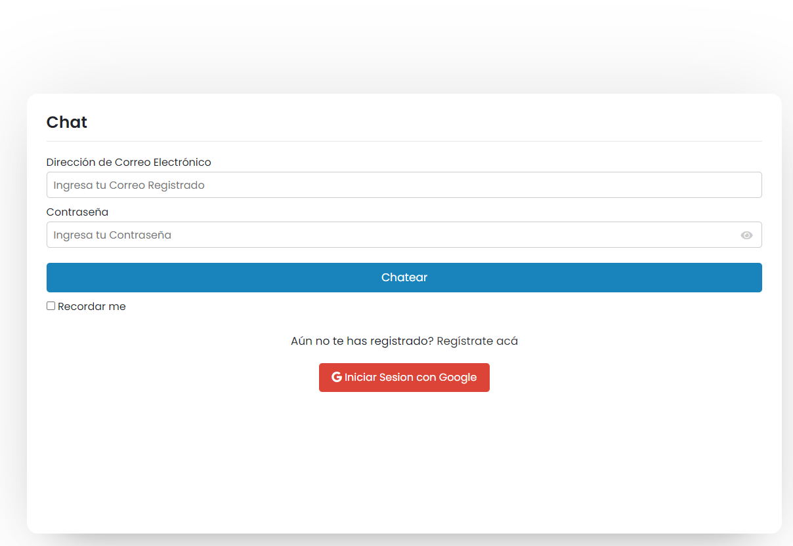
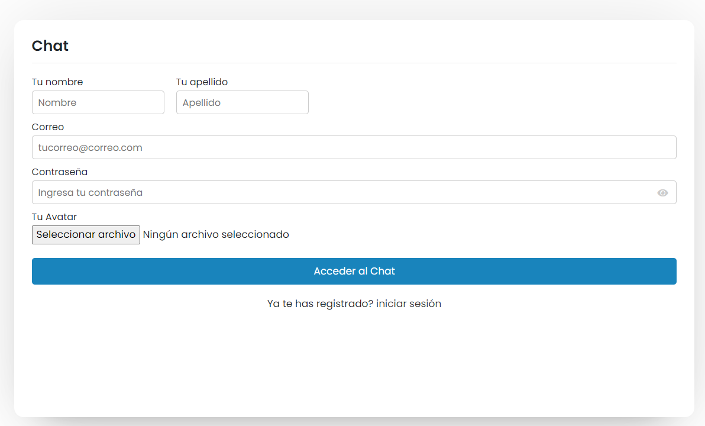

# Proyecto de Chat con PHP

Bienvenido al proyecto de chat desarrollado en PHP. Esta aplicación permite a los usuarios registrarse, iniciar sesión, enviar mensajes, recibir notificaciones push a través de Firebase Cloud Messaging (FCM), gestionar administradores (si el usuario es un super administrador), editar su perfil, adjuntar archivos y enviar enlaces para videollamadas, entre otras funcionalidades.

## Características Principales

- **Registro y Inicio de Sesión**: Los usuarios pueden registrarse e iniciar sesión de forma segura.
- **Responsive Design**: La aplicación es compatible con dispositivos móviles y se adapta a diferentes tamaños de pantalla para proporcionar una experiencia de usuario óptima.
- **Envío de Mensajes**: Los usuarios pueden comunicarse entre sí mediante el envío de mensajes.
- **Notificaciones Push**: Se utilizan las notificaciones push de Firebase para enviar alertas en tiempo real a los dispositivos de los usuarios.
- **Gestión de Administradores**: Los super administradores tienen el poder de gestionar los roles de los usuarios en el sistema.
- **Adjuntar Archivos y Enviar Enlaces**: Los usuarios pueden compartir archivos y enlaces a videollamadas.
- 
## Configuración Adicional

### Configuración de Firebase

Para configurar las notificaciones push a través de Firebase Cloud Messaging (FCM), sigue estos pasos:

1. Crea un proyecto en [Firebase Console](https://console.firebase.google.com/).
2. Obtén las credenciales de Firebase (Firebase Web SDK) y configúralas en tu aplicación PHP.
3. Configura la base de datos en tiempo real de Firebase para enviar notificaciones a los dispositivos de los usuarios.
4. Modifica el firebaseConfig para obtener el token (`javascript/message.js`) y la ruta para hacer la petición de envío de notificaciones push (`php/send-push`).

### Configuración de la Base de Datos

La aplicación utiliza MySQL como base de datos. Asegúrate de configurar la conexión a la base de datos en el archivo de configuración adecuado (`php/config.php`).

### Configuración del Correo Electrónico

Para enviar correos electrónicos de verificación de cuentas, restablecimiento de contraseñas u otras notificaciones por correo electrónico, configura los parámetros de correo electrónico en la aplicación.(`php/send-email.php`).
## Capturas de Pantalla

A continuación, algunas capturas de pantalla de la aplicación:

## Requisitos del Sistema

- PHP 8.x
- MySQL
- Servidor web (por ejemplo, Apache o Nginx)
- Firebase Cloud Messaging (FCM) para notificaciones push

¡Disfruta de tu experiencia de chat con PHP!
